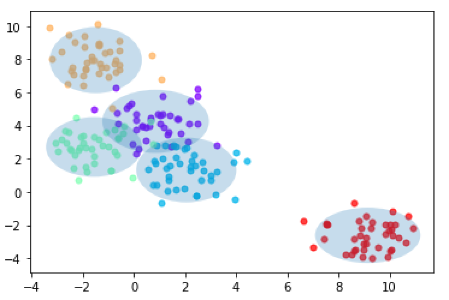
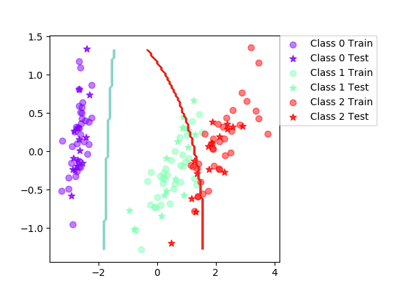

# Lab 3 

1.
> Write a function, mlParams(X,labels), that computes the ML- estimates of μk and Σk for the different classes in the dataset. X here is a set of row vectors, and labels are the class labels for each of the data points (again, ignore the W argument for now). The function should return a C × d-array mu that contains the class means, a C × d × d-array sigma that contains the class covariances. The covariance should be implemented using your own code and not by applying a library function.

Use the provided function, genBlobs(), that returns Gaussian distributed data points together with class labels, to generate some test data. Compute the ML-estimates for the data and plot the 95%-confidence interval using the function plotGaussians.

Answer:
```python
    # Iterate over both index and value
    for jdx, classes in enumerate(classes):
        idx = labels == classes # Returns a true or false with the length of y
        # Or more compactly extract the indices for which y==class is true,
        # analogous to MATLAB’s find
        idx = np.where(labels == classes)[0]

        xlc = X[idx,:] # Get the x for the class labels. Vectors are rows.
        """
        xlc contains the vectors for each indivual class which is looped through
        hence the mean vector is obtain through sum_i xlc_i/N for each class. axis = 0
        takes the mean of each column.
        """
        mu[jdx] += np.mean(xlc, axis = 0) 
        """
        Assuming the first column is the x-values and the second column is the
        y-values.
        """
        for i in range(2): 
            temp = []
            for rows in range(0,xlc.shape[0]):
                temp.append(pow(xlc[rows][i]-mu[jdx][i],2))
            sigma[jdx][i][i] = np.mean(temp)
```

<p>
    
    <em>Plot for 95%-confidence interval.</em>

</p>

2. 

> a) Write a function computePrior(labels) that estimates and returns the class prior in X (ignore the W argument).

Answer:
```python
    # Iterate over both index and value
    for jdx,classes in enumerate(classes):
        idx = labels == classes # Returns a true or false with the length of y
        # Or more compactly extract the indices for which y==class is true,
        # analogous to MATLAB’s find
        idx = np.where(labels==classes)[0]
        prior[jdx] = len(idx)/len(labels)
```
> b) Write a function classifyBayes(X,prior,mu,sigma) that computes the dis- criminant function values for all classes and data points, and classifies each point to belong to the max discriminant value. The function should return a length N vector containing the predicted class value for each point.

Answer: 

```python

# For each class 
for classes in range (0,Nclasses):
    # np.log is ln, whereas np.log10 is your standard base 10 log. - Stack Overflow
    ln_sigma = -0.5 * np.log(np.linalg.det(sigma[classes]))
    ln_class_prior = np.log(prior[classes])
    sub_mean = X - mu[classes] 
    # For each data point logProb = np.zeros((Nclasses, Npts))
    for data_points in range(0,Npts):
        # In reference to logProb = np.zeros((Nclasses, Npts))
        # Note that sigma only has values on the diagonal
        logProb[classes][data_points] = ln_sigma
        - 0.5 * np.inner(sub_mean[data_points]/np.diag(sigma[classes]), sub_mean[data_points])
        + ln_class_prior

```

3.
> We now have all functions we need for doing the training and
classification. Use the provided function testClassifier to test the accuracy for the
vowels and iris datasets. testClassifier runs a loop that does the following things:
> * Uses the provided random partitioning function to split the dataset into a train-
ing and test dataset.
> * Trains your classifier on the training partition.
> * Evaluate the performance of the classifier on the test partition.
Run testClassifier for the datasets and take note of the accuracies. Use plotBoundary
to plot the decision boundary of the 2D iris dataset.
<p>
    
    <em>Boundary for iris dataset.</em>
</p>

# Vowels

| Trial      | Accuracy      |
| ------------- |:-------------:| 
|0    | 61 | 
|10     | 66,2|  
|20 |   74  | 
|  30   |66.9|  
|    40 | 59.7|  
|   50  |64.3 |  
|   60  | 66.9|  
|   70  |63.6 |  
|   80  | 62.3|  
|   90  | 70.8 |  

Final mean classification accuracy  64.7 with standard deviation 4.03.

# Iris
| Trial      | Accuracy      |
| ------------- |:-------------:| 
|0    | 84.4  | 
|10     | 95.6|  
|20 |   93.3  | 
|  30   |86.7 |  
|    40 | 88.9|  
|   50  |91.1 |  
|   60  | 86.7|  
|   70  | 91.1 |  
|   80  | 86.7|  
|   90  | 91.1 |  

Final mean classification accuracy  89 with standard deviation 4.16.

> Answer the following questions:
a) When can a feature independence assumption be reasonable and when not?

Answer : The assumption is useful when the features, x_i, of the vector x are conditionally independent given classification. Note that the model can still performe well if the features are reasonably independent. However, it is not reasonable to apply this assumption when the dataset is not reasonably independent, highly independent.

> b) How does the decision boundary look for the Iris dataset? How could one improve
the classification results for this scenario by changing classifier or, alternatively,
manipulating the data?

Answer: It is clear that the boundary between class 1 and 2 is not successful from the iris boundary figure. The dataset implies strongly that a support vector machine could improve the results.

4.

> Extend the old mlParams function to mlParams(X, labels, W) that handles weighted instances. Again X is N x d matrix of feature vectors, labels a length N vector containing the corresponding labels and W is a N x 1 matrix of weights.

Answer: The code has now been changed to

```python
for jdx, classes in enumerate(classes):
    idx = labels == classes 
    idx = np.where(labels == classes)[0]
    # xlc contains the vectors for each indivual class which is looped through
    xlc = X[idx,:] # Get the x for the class labels. Vectors are rows. N X d vector
    wlc = W[idx,:] # Get the w for the class labels. N X 1 vector
    mu[jdx] += np.sum(xlc * wlc, axis=0) / np.sum(wlc) # Axis = 0 so the result is a row vector
    """
    Assuming the first column is the x-values and the second column is the
    y-values.
    """
    for i in range(Ndims): 
        inv_wlc_sum = np.sum(wlc)
        temp = []
        for rows in range(0,xlc.shape[0]):
            # Added 1/(inv_wlc_sum) and wlc[rows]
            temp.append(1/(inv_wlc_sum) * wlc[rows] * pow(xlc[rows][i]-mu[jdx][i],2))
        sigma[jdx][i][i] = np.sum(temp)
```

5.

> Compute the classification accuracy of the boosted classifier on some data sets using testClassifier from labfuns.py and compare it with those of the basic classifier on the vowels and iris data sets.

Answer: 
# Iris
| Trial      | Accuracy      |
| ------------- |:-------------:| 
|0    | 100 | 
|10     | 93.3|  
|20 |   91.1 | 
|  30   |97.8 |  
|    40 | 93.3|  
|   50  |93.3 |  
|   60  | 97.8|  
|   70  | 91.1 |  
|   80  | 95.6|  
|   90  | 93.3 |  

Final mean classification accuracy  94.1 with standard deviation 6.72.

# Vowels
| Trial      | Accuracy      |
| ------------- |:-------------:| 
|0    | 76.6 | 
|10     | 86.4|  
|20 |   83.1 | 
|  30   |80.5 |  
|    40 | 72.7|  
|   50  |76 |  
|   60  | 81.8|  
|   70  | 82.5 |  
|   80  | 79.9|  
|   90  | 83.1 |  

Final mean classification accuracy  80.2 with standard deviation 3.52.

5a)

> Is there any improvement in classification accuracy? Why/why not?

Answer: The classification accuracy for the ensemble method compared to the basic classifier perform better. This is due to a collection of high-bias classifiers combined in the form of boosting can create one classifier with low bias.

5b)

> Plot the decision boundary of the boosted classifier on iris and compare it with that of the basic. What differences do you notice? Is the boundary of the boosted version more complex?

Answer: 

<p>
    
    <em>Plot for the improved iris classifier. </em>

</p>

5c)

> Can we make up for not using a more advanced model in the basic classifier
(e.g. independent features) by using boosting?


