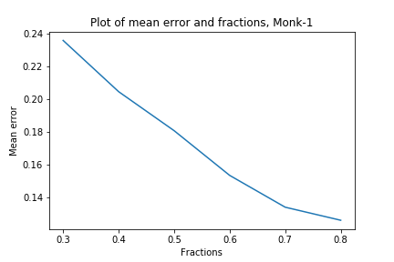
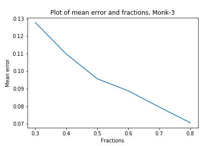

# Lab 1 (Decision Trees)
0. 
> Each one of the datasets has properties which makes
them hard to learn. Motivate which of the three problems is most
difficult for a decision tree algorithm to learn.

Answer: For the first dataset two attributes, a_1 and a_2, are related therefore it is hard for the decision tree to split between these. The second dataset two arbitrary attributes are needed to have the value one to be true, hence it is the hardest dataset to split. The third dataset contains the smallest training set and noise.

1.
> The file dtree.py defines a function entropy which
calculates the entropy of a dataset. Import this file along with the monks datasets and use it to calculate the entropy of the training
datasets.

Answer: 

| Dataset        | Entropy           |
| ------------- |:-------------:| 
| MONK-1    | 1  | 
| MONK-2      | 0.957117428264771   |  
| MONK-3 |    0.9998061328047111  | 

2.
> Explain entropy for a uniform distribution and a non-uniform distribution, present some example distributions with
high and low entropy.

Answer: Entropy measures the uncertainty. Hence in reference to lecture 2, rolling a fake dice, a nonuniform distribution, with an higher probability to land on one side implies the entropy becomes numerically lower in comparison to rolling a real dice, which is a uniform distribution. In other words since the probability is higher for one side on the fake dice, the total uncertainty of the total fake dice is lower than for a real dice.

3.
>Use the function averageGain (dened in dtree.py) to calculate the expected information gain corresponding to each of the six attributes.  Note that the attributes are represented as instances of the class Attribute (dened in monkdata.py) which you can access via m.attributes[0], ..., m.attributes[5]. Based on the results, which attribute should be used for splitting the examples at the root node?

Answer: 

| Dataset | a_1     | a_2    | a_3     | a_4    | a_5    | a_6     |
|---------|:---------:|--------|---------|--------|--------|---------|
| MONK-1  | 0.075   | 0.0058 | 0.0047  | 0.0263 | 0.2870 | 0.00075 |
| MONK-2  | 0.00375 | 0.0024 | 0.0010  | 0.0156 | 0.0172 | 0.0062  |
| MONK-3  | 0.00712 | 0.2937 | 0.00083 | 0.0028 | 0.2559 | 0.0070  |

The attribute with the highest value on the information gain is selected for splitting. For MONK-1: a_5, MONK-2: a_5 and for MONK-3: a_2.

4.
>For splitting we choose the attribute that maximizes
the information gain, Eq.3. Looking at Eq.3 how does the entropy of
the subsets, Sk, look like when the information gain is maximized?
How can we motivate using the information gain as a heuristic for
picking an attribute for splitting? Think about reduction in entropy
after the split and what the entropy implies.

Answer:

Information gain is calculated using the current entropy and subtracting the weighted sum of the split subset entropy.  If the information gain is high the entropy of the subset is low. That is the subsets are “unmixed”. The subsets that have the lowest uncertainty i.e lowest entropy gives us the highest information gain. As we want to unmix each subset as much as possible using information gain is a good heuristic for splitting.
			
5.
> Compute the train and test set errors for the three Monk datasets for the full trees. Were your assumptions about the datasets correct? Explain the results you get for the training and test datasets.

Answer: 

|       | E_train          | E_test |
| ------------- |:-------------:| :-------------:| 
| MONK-1    | 1  |  0.8287 | 
| MONK-2      | 1   |   0.6921|
| MONK-3 |    1  |  0.9444 |

In consideration to the assumptions the results are correct. E_train is always 1 because the model is trained on the data. E_test measures the accuracy of datasets that the model has not been trained on.

6.
> Explain pruning from a bias variance trade-off perspective.

Answer: The depth of the tree determines the complexity. High complexity yields high variance and low bias. However, pruning lowers the depth and therefore reduces the variance but increases the bias.

7.
> Evaluate the effect pruning has on the test error for
the monk1 and monk3 datasets, in particular determine the optimal
partition into training and pruning by optimizing the parameter
fraction. Plot the classification error on the test sets as a function
of the parameter fraction 2 f0:3; 0:4; 0:5; 0:6; 0:7; 0:8g.

Answer:

From both figures we can see that the error is reduced for a higher fraction of training data.
