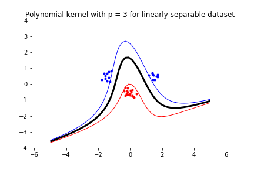

# Lab 2 (Support Vector Machine)
1.
> Move the clusters around and change their sizes to make it easier or harder for the classifier to find a decent boundary. Pay attention to when the optimizer (minimize function) is not able to find a solution at all.

Answer: When the dataset is linearly separable the minimize function can find a solution, and a decision boundary is drawn. However, if the dataset is not linearly separable, then the minimize function can not find a solution and a decision boundary will not be drawn due to there does not exist a line that separetas the datasets. 

 

2.
> Implement the two non-linear kernels. You should be able to clas- sify very hard data sets with these.

 

Answer: Using the same cluster type as the non linearly separable dataset as the first figure, which the linear kernel could not find a solution to. The polynomial and radial basis function kernel solves and draws a boundary decision to.

3. 
> The non-linear kernels have parameters; explore how they influence the decision boundary. Reason about this in terms of the bias-variance trade-off.

Answer: 

 
 

 
 
