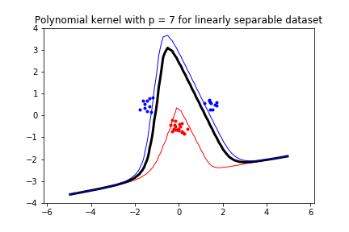

# Lab 2 (Support Vector Machine)
1.
> Move the clusters around and change their sizes to make it easier or harder for the classifier to find a decent boundary. Pay attention to when the optimizer (minimize function) is not able to find a solution at all.

Answer: When the dataset is linearly separable the minimize function can find a solution, and a decision boundary is drawn. However, if the dataset is not linearly separable, then the minimize function can not find a solution and a decision boundary will not be drawn due to there does not exist a line that separetas the datasets. 

  
   

2.
> Implement the two non-linear kernels. You should be able to clas- sify very hard data sets with these.

  
   

Answer: Using the same cluster type as the non linearly separable dataset as the first figure, which the linear kernel could not find a solution to. The polynomial and radial basis function kernel solves and draws a boundary decision to.

3. 
> The non-linear kernels have parameters; explore how they influence the decision boundary. Reason about this in terms of the bias-variance trade-off.

Answer: For the polynomial case as p increases the decision boundary becomes more complex. Thus the decision boundary implies that the variance is high and the bias low, and for for lower values on p the opposite occurs. However, for the radial basis function the equivalent development appears for lower values on sigma, the variance is high and the bias low, and for higher values on sigma, the variance is low and the bias high.

  
   

  
   

  
   

  
   

4.
> Explore the role of the slack parameter C. What happens for very large/small values?

Answer: For small values on C the misclassification rate is higher and for higher values on C the misclassifciation rate is lower. Note that C is multiplied with the error variable that measures the amount of misclassification.

  
   

5.
> Imagine that you are given data that is not easily separable. When should you opt for more slack rather than going for a more complex model (kernel) and vice versa?

Answer: Depending if the data contains a lot of noise and is in a low dimensionality, opting for more slack is a better option. However, if the complexity of the data is high, it is more viable to use a more complex model for classification. 
