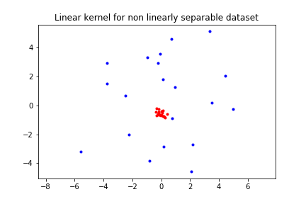

# Lab 2 (Support Vector Machine)
1.
> Move the clusters around and change their sizes to make it easier or harder for the classifier to find a decent boundary. Pay attention to when the optimizer (minimize function) is not able to find a solution at all.

Answer: When the dataset is linearly separable the minimize function can find a solution, and a decision boundary is drawn. However, if the dataset is not linearly separable, then the minimize function can not find a solution and a decision boundary will not be drawn due to there does not exist a line that separetas the datasets. 
 
